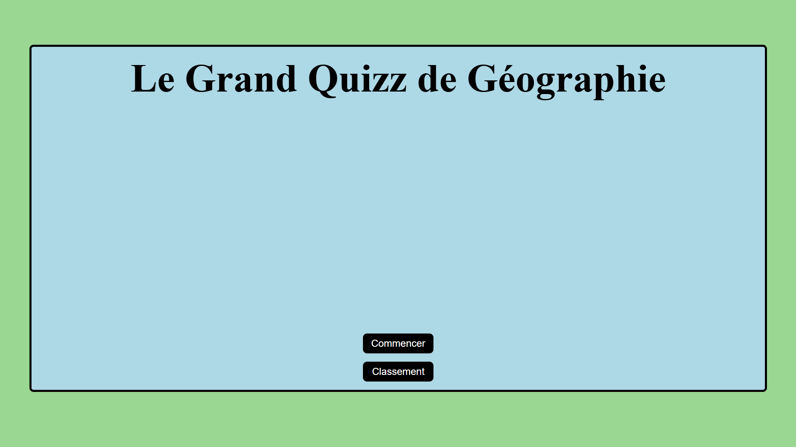

# ❓ Quizz – Culture Générale 🧠

Ce site est un jeu en ligne de **quizz interactifs** sur le thème de la **Géographie**. Développé dans un cadre pédagogique, il met à l’épreuve les connaissances des utilisateurs dans un format ludique et responsive.

## 🌐 Démo en ligne

🔗 https://lucas-godebout.mds-angers.yt/quizz/

## 📸 Aperçu

## 🎯 Objectifs du projet

- Proposer une expérience de quizz simple, rapide et amusante
- Appliquer des connaissances en HTML/CSS/JS pour gérer l’affichage dynamique
- Mettre en place un système de score en temps réel
- Offrir une interface claire et responsive accessible à tous

## 🛠️ Technologies utilisées

- **HTML5** – Structure du contenu
- **CSS3** – Mise en forme et responsive design
- **JavaScript** – Logique du quizz, gestion des réponses et score

## 🎮 Fonctionnalités principales

- 🧩 Questions à choix multiples avec validation immédiate
- 🧠 Calcul du score en direct
- 🔁 Possibilité de rejouer le quizz
- 📱 Responsive sur mobile, tablette et desktop
- 🎨 Interface simple et ludique

## 👤 Réalisé par

- **Lucas Godebout** – Développement, design et intégration

## 📆 Contexte

Projet réalisé dans le cadre d’une formation web à MyDigitalSchool Angers, ayant pour but de créer un mini-jeu interactif 100% front-end.

## 🚀 Pistes d’amélioration

- Ajouter un système de sélection de thématiques (histoire, sport, cinéma…)
- Sauvegarder les scores avec le **LocalStorage**
- Créer une base de données pour un classement multi-utilisateur

## 📄 Licence

Projet éducatif – Tous droits réservés © 2025
